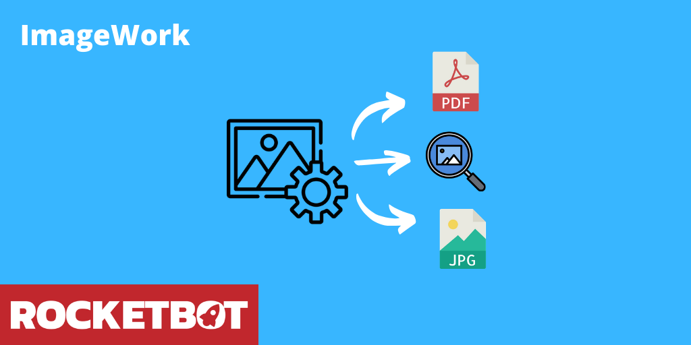

# ImageWork
  
Módulo para el manejo de imágenes. Permite fusionar, buscar imagen en imagen, combinar, recortar imágenes y más.  

*Read this in other languages: [English](Manual_ImageWork.md), [Português](Manual_ImageWork.pr.md), [Español](Manual_ImageWork.es.md)*
  

## Como instalar este módulo
  
Para instalar el módulo en Rocketbot Studio, se puede hacer de dos formas:
1. Manual: __Descargar__ el archivo .zip y descomprimirlo en la carpeta modules. El nombre de la carpeta debe ser el mismo al del módulo y dentro debe tener los siguientes archivos y carpetas: \__init__.py, package.json, docs, example y libs. Si tiene abierta la aplicación, refresca el navegador para poder utilizar el nuevo modulo.
2. Automática: Al ingresar a Rocketbot Studio sobre el margen derecho encontrara la sección de **Addons**, seleccionar **Install Mods**, buscar el modulo deseado y presionar install.  

## Descripción de los comandos

### Fusionar imágenes
  
Este comando permite fusionar dos imágenes en una sola, la segunda imagen se superpone a la primera en las coordenadas indicadas. La ruta del archivo resultante será la misma de la primer imagen
|Parámetros|Descripción|ejemplo|
| --- | --- | --- |
|Path del archivo JPG a mezclar|Ruta del archivo JPG que se va a mezclar con el segundo JPG. La imagen resultante será guardada en la misma ruta que el primer JPG.|JPG|
|Path del segundo archivo JPG a mezclar|Ruta del segundo archivo JPG que se va a mezclar con el primer JPG. La imagen resultante será guardada en la misma ruta que el primer JPG.|JPG|
|Coordenadas|Coordenadas donde se superpone la segunda imagen a la primera. El formato es X, Y.|150, 340|
|Resultado|Variable donde se almacena True o False según el resultado de la operación||

### Convertir a PDF
  
Convierte archivos JPG a PDF
|Parámetros|Descripción|ejemplo|
| --- | --- | --- |
|Path de la carpeta con archivos JPG|Carpeta con archivos JPG a convertir a PDF|JPG|
|Path y nombre del PDF|Path y nombre del PDF a crear|PDF|
|Resultado|Variable donde se almacena True o False según el resultado de la operación||

### Buscar imagen en imagen
  
Este comando busca si la imagen 1 contiene la imagen 2 dentro y devuelve True o False dependiendo del resultado
|Parámetros|Descripción|ejemplo|
| --- | --- | --- |
|Imagen 1|Ruta de la imagen donde buscar la imagen 2|image1.JPG|
|Imagen 2|Ruta de la imagen que se buscará en la imagen 1|image2.JPG|
|Mínimo de similitud|Mínimo de similitud que deberá haber entre las imágenes para que lo tome como válido. Valor entre 0 y 1|0.9|
|Resultado|Variable donde se almacenará True o False dependiendo del resultado|result|

### Extraer texto
  
Extrae el texto de un área específica de una imagen
|Parámetros|Descripción|ejemplo|
| --- | --- | --- |
|Path del archivo JPG o PDF|Ruta del archivo JPG o PDF que se va a procesar|JPG o PDF|
|Coordenadas|Coordenadas de la esquina superior izquierda del área a extraer|150, 340|
|Dimensiones|Dimensiones del área a extraer|250x200|
|Página|Página que se leerá del PDF||
|Resultado|Variable donde se almacena el texto extraído||

### Recortar imagen
  
Corta una imagen desde coordenadas
|Parámetros|Descripción|ejemplo|
| --- | --- | --- |
|Imagen de entrada|Ruta donde se encuentra la imagen a recortar|/ruta/a/imagen.png|
|Path y nombre de archivo JPG|Ruta y nombre de archivo JPG de salida|JPG|
|Coordenadas|Coordenadas de inicio de recorte|x,y|
|Dimensiones|Dimensiones de recorte|width, height|

### Combinar imágenes
  
Combina dos imágenes en una sola manteniendo el tamaño de cada imagen. Puede combinarse horizontal o verticalmente
|Parámetros|Descripción|ejemplo|
| --- | --- | --- |
|Imagen 1|Imagen 1 a combinar. Será posicionada a la izquierda o arriba de la imagen 2 según la orientación seleccionada|C:/Users/User/desktop/imagen1.png|
|Imagen 2|Imagen 2 a combinar. Será posicionada a la derecha o abajo de la imagen 1 según la orientación seleccionada|C:/Users/User/desktop/imagen2.png|
|Orientación|Selecciona la orientación de la imagen resultante|Horizontal|
|Imagen combinada|Ruta de la imagen resultante|C:/Users/User/desktop/imagenCombinada.png|

### Comparar similitudes entre imágenes
  
Compara una imagen con una carpeta de imágenes y devuelve el porcentaje de similitud entre ellas.
|Parámetros|Descripción|ejemplo|
| --- | --- | --- |
|Imagen a comparar|Imagen a comparar con las imágenes de la carpeta seleccionada.|C:/Users/User/desktop/imagen1.png|
|Carpeta de imágenes|Carpeta con las imágenes a comparar con la imagen seleccionada.|C:/Users/User/desktop/carpetaImagenes|
|Carpeta de resultados|Carpeta donde se almacenarán los resultados de la comparación.|C:/Users/User/desktop/resultados|
|Tamaño de redimensión en px|Para que el comando funcione correctamente, es necesario establecer un tamaño de redimensión para las imágenes. Por defecto es 500,500|500,500|
|Resultado|Variable donde se almacenará el nivel de coincidencias con cada imagen|variable|
